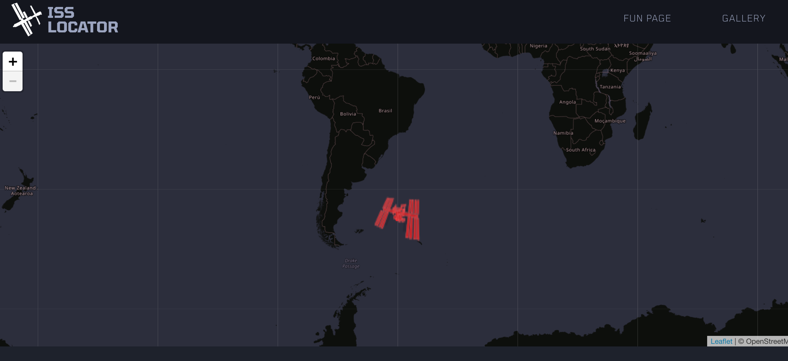
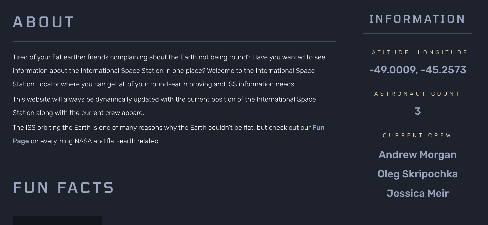

# ISS-Tracker

International Space Station (ISS)  Tracker is an application that tracks the ISS around earth. It provides information of current location of the tracker in terms of latitude and longitude. It give names and number of astronauts in the station while it is circling an imaginary orbit in the solar system. In addition to that, one can see fun facts and memories in the station.

